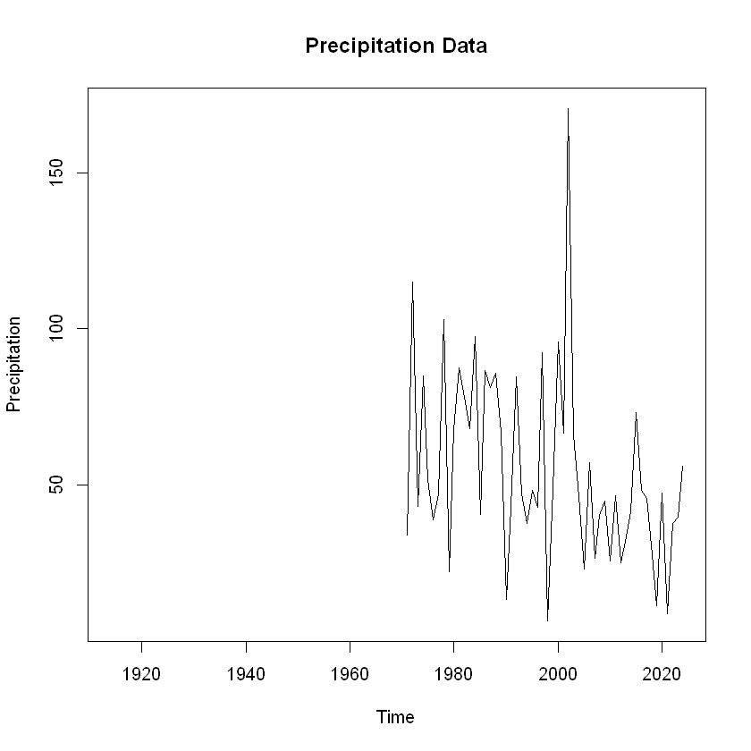
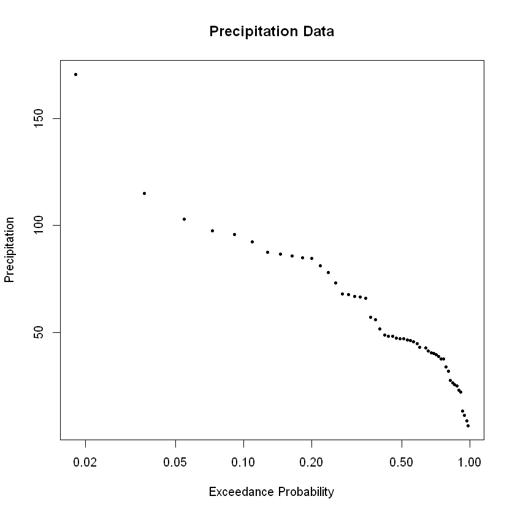
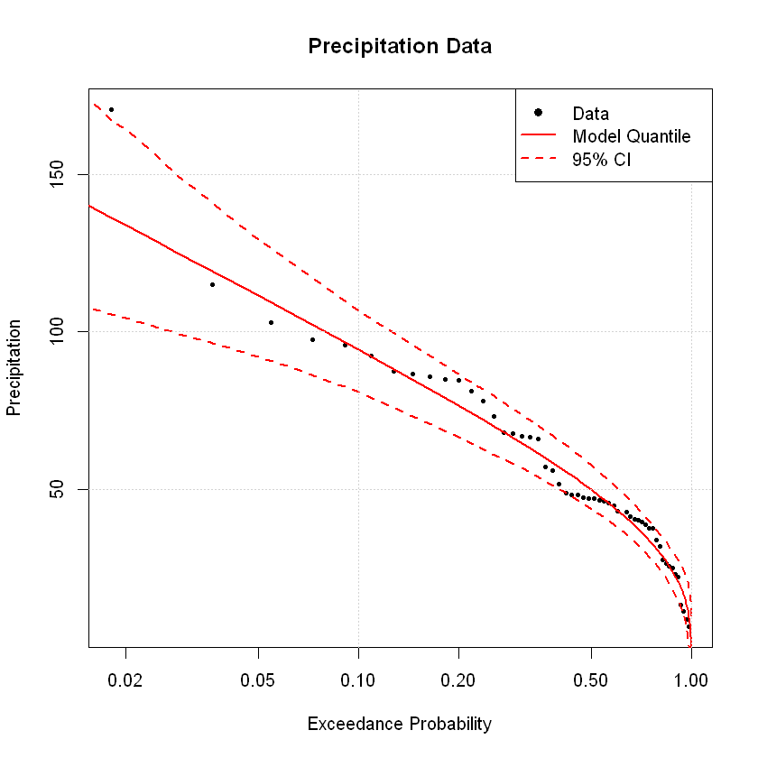

### HEVAwR

Hydrological Extreme Value Analysis with R (`HEVAwR`) is a project designed to facilitate probabilistic modeling of hydrological datasets. It provides tools for fitting statistical distributions, computing exceedance probabilities, and generating confidence intervals for extreme value analysis.

### Example

Import libraries

```R
library("openxlsx")
source("fit_utils.R")
source("test_utils.R")
```

Load toy data and plot

```R
# Load example data
data <- read.xlsx("data/ExamplePrecipitationData.xlsx", sheet = "data")
years <- data[, 1]
data  <- data[, -1]
data <- data[, 40] # Select the 40th column as an example
```

```R
plot(years, data, type = "l",
     main = "Precipitation Data",
     xlab = "Time",
     ylab = "Precipitation")
```



Compute empirical exceedance probabilities

```R
ndata <- data[!is.na(data)]                        # Remove NA values
ndata <- ndata[order(ndata, decreasing = TRUE)]    # Sort in descending order
ndata_rank <- rank(-ndata, ties.method = "max")    # Rank the data
ndata_pexc <- ndata_rank / (length(ndata) + 1)     # Exceedance probability

plot(ndata_pexc, ndata, log = "x",
     main = "Precipitation Data",
     ylab = "Precipitation",
     xlab = "Exceedance Probability",
     pch = 19, cex = 0.5)
```



Fit a statistical distribution/model:

Options include normal distribution (`"norm"`), two-parameter lognormal (`"lognorm"`), Pearson Type III (`"pearson3"`), log-Pearson Type III (`"logpearson3"`), Gumbel (`"gumbel"`), and generalized extreme value (`"gev"`).
Fit methods include maximum likelihood estimation (`"mle"`), ordinary moment matching estimation (`"mme"`), L-moment matching estimation (`"lmme"`), and maximum goodness-of-fit estimation (`"mge"`). By default, `"mge"` optimizes for the Cramer-von Mises statistic; however, other goodness-of-fit metrics can be specified (details available in the `fitdistrplus` package).

```R
method <- "lmme" # Options "mle", "mme", "mge"
distr  <- "gev" # Options "norm", "lognorm", "pearson3", "logpearson3", "gumbel"
params <- fit_probmodel(ndata, distr = distr, method = method)

model_rperiods <- c(seq(1.001, 1.009, 0.001), seq(1.01, 1.09, 0.01),
                    seq(1.1, 5, 0.1), seq(10, 1000, 5))
model_pexc <- 1 / model_rperiods
model_nonpexc <- 1 - model_pexc
model_pdf   <- dprobmodel(ndata, distr = distr, params = params)
model_cdf   <- pprobmodel(ndata, distr = distr, params = params)
model_quant <- qprobmodel(model_nonpexc, distr = distr, params = params)
```

Compute new parameter distributions by generating random samples with replacement

```R
nparams <- bootstrap_probmodel(ndata, niters = 1000, dist = distr,
                               method = method, replace = TRUE)
```

Compute confidence intervals

```R
# Initialize a matrix to store the results
model_iterations <- matrix(NA, nrow = nrow(nparams),
                           ncol = length(model_nonpexc))

# Loop through each row of nparams and compute qprobmodel
for (i in seq(1, nrow(nparams))) {
  model_iterations[i, ] <- qprobmodel(model_nonpexc, distr = distr,
                                      params = nparams[i, ])
}

# Compute 95% confidence intervals
ci <- apply(model_iterations, 2, quantile, probs = c(0.05, 0.95))
```

```R
plot(ndata_pexc, ndata, log = "x",
     main = "Precipitation Data",
     ylab = "Precipitation",
     xlab = "Exceedance Probability",
     pch = 19, cex = 0.5)

lines(model_pexc, ci[1, ], col = "red", lwd = 2, lty = 2)
lines(model_pexc, model_quant, col = "red", lwd = 2)
lines(model_pexc, ci[2, ], col = "red", lwd = 2, lty = 2)

# Add gridlines
grid()

legend("topright", legend = c("Data", "Model Quantile", "95% CI"),
       col = c("black", "red", "red"), lty = c(NA, 1, 2),
       pch = c(19, NA, NA),
       lwd = c(NA, 2, 2))
```


